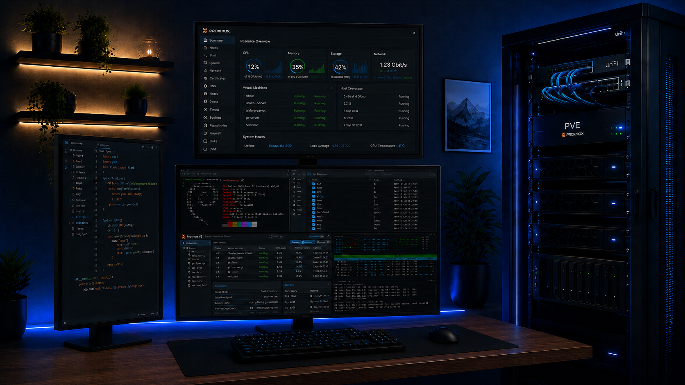
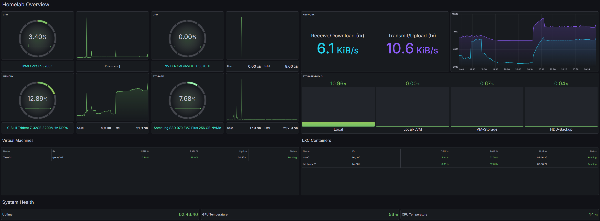

# 🛡️ Stefans - Homelab [ARGUS]
ARGUS ist der schrittweise Aufbau eines privaten Homelabs zu einer realitätsnahen Testumgebung, die typische Enterprise-Infrastruktur abbildet: Virtualisierung, Netzwerk, Windows-/Linux-Systeme, Monitoring und perspektivisch
Security-Detection.
Ziel ist es, eine private, praxisnahe Umgebung zum Lernen, Testen und Entwickeln aufzubauen, die langfristig verschiedene Szenarien aus den Bereichen IT-Infrastruktur und IT-Security ermöglicht.


<sub>*Bild KI-generiert.*</sub>

> **Hinweis:** Dieses Repository befindet sich in aktiver Entwicklung. Dokumentation und README werden fortlaufend erweitert und aktualisiert. Es kann vorkommen, dass einzelne Komponenten bereits umgesetzt, aber noch nicht vollständig dokumentiert sind. Ich bemühe mich, den Stand zeitnah nachzuziehen.

# 🖥️ Server
Als Basis und zum Start des Projekts dient mein alter Gaming-PC als Virtualisierungshost. Die Hardware reicht für den aktuellen Scope aus, ohne dass eine Neuanschaffung nötig war. Für Backups und co. soll hier zeitnah ein NAS als zweiter Server folgen.

## 💻 Server 1 - Proxmox Node
- CPU: Intel Core i7-9700K
- RAM: G.Skill Trident Z 32 GB 3200mhz DDR4 (2 x 16 GB)
- GPU: Zotac RTX 3070 Ti 8 GB VRAM
- Motherboard: ASUS ROG STRIX Z390-I GAMING
- Storage:
  - Samsung SSD 970 EVO Plus 256 GB NVMe (Proxmox OS)
  - SanDisk SSD 2 TB SATA (Storage für VMs und Container)
  - Western Digital HDD 2 TB SATA (ISOs und Backups -> vorrübergehend)
- Gehäuse: Corsair Crystal 280X

# 🌐 Netzwerk
Aktuell läuft das Homelab über eine handelsübliche FRITZ!Box in einem klassischen Consumer-Heimnetz. Für den weiteren Ausbau ist eine Migration auf UniFi geplant, da dies technische Möglichkeiten wie z. B.:
- VLAN-Segmentierung
- IDS/IPS (Threat Management)
- Client-/Netzwerk-Isolation

ermöglicht.
Die Migration wird ebenfalls dokumentiert und hier festgehalten. Bis dahin bleibt die FRITZ!Box die produktive Basis.

# 📈 Monitoring
Zentrale Überwachung von Host und Gastsystemen über Prometheus und Grafana. Details siehe [mon01.md](/docs/mon01.md).


<sub>*Grafana-Dashboard_v1*</sub>


# 🧰 Tech-Stack

| Logo | Name | Beschreibung |
|:---:|---|---|
|  | [Proxmox](https://www.proxmox.com/) | Virtualisierungsplattform |
|  | [Prometheus](https://prometheus.io/) | Toolkit für Systemüberwachung und Alerting |
|  | [Grafana](https://grafana.com/) | Überwachungs-Oberfläche |

# 📁 Repo-Struktur

```
argus-homelab/
├── README.md                # Projektüberblick
├── assets/
│   ├── images/
│   ├── logos/
│   └── screenshots/
├── docs/                    # Technische Komponenten-Doku (Konfigurationen, relevante Befehle, offene Punkte, etc.)
|   ├── pve01.md
|   └── mon01.md
└── reports/                 # Meilenstein-Reports (Ist → Soll → Umsetzung → Fazit)

```

# 📊 Status

| Phase | Komponente | Status | Datum | Doku |
|---|---|---|---|---|
| 1 | Proxmox-Installation | ✅ Abgeschlossen | 09-08-2026 | [pve01.md](/docs/pve01.md) |
| 2 | Monitoring-Stack | ✅ Abgeschlossen | 13-08-2026 | [mon01.md](/docs/mon01.md) |
| 3 | Active Directory | ⏳ In Bearbeitung | - | 📝 in Bearbeitung |

# 📬 Kontakt
Bei Fragen, Anregungen, Tipps oder Anmerkungen erreichst du mich gerne über [LinkedIn](https://www.linkedin.com/in/stefan-höger-5a375a339/) oder [XING](https://www.xing.com/profile/Stefan_Hoeger049861/web_profiles?nwt_nav=profile).

Über Rückmeldungen und Austausch freue ich mich immer.
